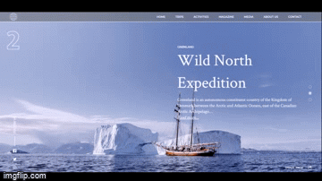
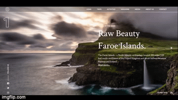
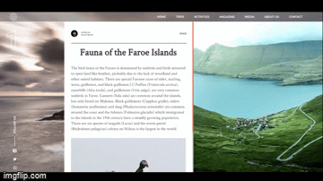

## Landing page with scroll animations

This project was bootstrapped with [Create React App](https://github.com/facebook/create-react-app).

Design from [here](https://www.instagram.com/p/B8n4ha1AeCw/?utm_source=ig_web_copy_link).

## Usage:

```
git clone "repository url"
cd "repository folder"
npm i
npm start
```

## Animations:

Scroll:\


Open post:\


Close button:\


Tested on Windows:

-  Opera
-  Chrome
-  Firefox
-  Edge

Not tested on IOS or any mobil device.
